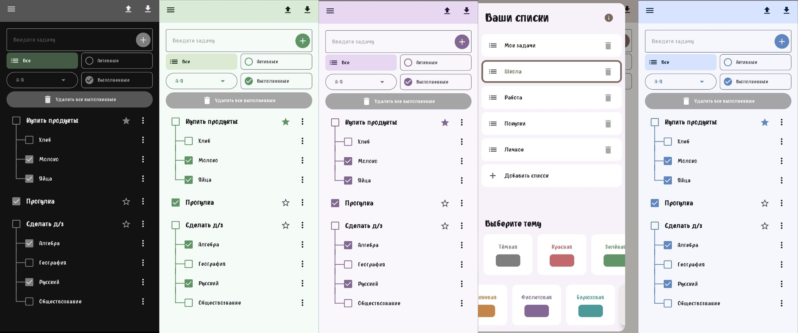

# 📝 ToDo List App на Kotlin 
**Простое и удобное приложение для управления задачами, написанное на Kotlin для Android.**

## ✨ Возможности
Добавление и удаление задач
- Отметка задач как выполненных и изменение их состояния
- Поддержка и отображение подзадач (иерархия задач)
- Сортировка задач по разным параметрам (А-Я, Я-А, новые/старые, выполненные/не выполненные)
- Фильтрация задач (Все, Активные, Выполненные)
- Поддержка нескольких списков задач с возможностью добавления и удаления списков
- Пометка задач как избранных (favorite)
- Редактирование текста задач
- Сохранение и загрузка данных из локальной базы настроек DataStore (Preferences DataStore)
- Импорт и экспорт задач в формате JSON
- Адаптивный UI с использованием Jetpack Compose и Material3
- Управление состояниями и анимациями для плавного UX
- Выбор и смена темы оформления приложения с несколькими предустановленными цветовыми схемами
- Выбор темы в боковом меню с визуальным отображением и переключением тем
- Горизонтальный список тем с двухрядной прокруткой
- Диалоги подтверждения удаления задач и списков
- Работа с асинхронными потоками данных с помощью Kotlin Flow и Coroutines

- ## 📸 Скриншоты


## 📌 Обновления
| Версия | Скачать                                                                                                    |
|--------|------------------------------------------------------------------------------------------------------------|
| 1.0.0   | [Скачать v1.0.0](https://github.com/Denis24-sdk/ToDo-List-in-Kotlin/releases/download/v1.0.0/ToDo-List-v1.0.0.apk)  |
| 1.1.0    | [Скачать v1.1.0](https://github.com/Denis24-sdk/ToDo-List-in-Kotlin/releases/download/v1.1.0/v1.1.0.apk)  |
| 1.2.0    | [Скачать v1.2.0](https://github.com/Denis24-sdk/ToDo-List-in-Kotlin/releases/download/v1.2.0/v1.2.0.apk)  |
| 1.3.0    | [Скачать v1.3.0](https://github.com/Denis24-sdk/ToDo-List-in-Kotlin/releases/download/v1.3.0/ToDoList-v1.3.0.apk)  |


**Релизы:** [Ссылка](https://github.com/Denis24-sdk/ToDo-List-in-Kotlin/releases)
                

## 🛠 Технологии
- Kotlin — основной язык программирования приложения.
- Jetpack Compose — современный декларативный UI-фреймворк от Google для создания интерфейсов на Android.
- AndroidX Activity (ComponentActivity) — базовый класс для активности с поддержкой Jetpack Compose.
- Material3 (Material You) — библиотека компонентов Material Design 3 для Compose (material3).
- Compose Animation — API для анимаций в Jetpack Compose (animation, animation.core, animation.fadeIn, animation.fadeOut и прочие).
- Compose Foundation и LazyColumn — базовые компоненты интерфейса и списков в Compose (foundation, foundation.lazy).
- Jetpack DataStore (Preferences DataStore) — современный способ хранения данных настроек и небольших структурированных данных (используется для хранения списков задач).
- Gson — библиотека для сериализации и десериализации объектов Kotlin в JSON и обратно.
- Kotlin Coroutines — для асинхронного программирования и работы с потоками данных (lifecycleScope, launch).
- Flow (Kotlin Flow) — реактивный поток данных для наблюдения за изменениями в DataStore.
- Material Icons — иконки из набора Material Design (Icons.Default.*).
- Activity Result API (ActivityResultLauncher, ActivityResultContracts) — для получения результатов из внешних компонентов Android (например, диалога выбора документа).
- Jetpack Compose Gesture Detectors — обработка жестов (pointerInput, detectTapGestures).
- Jetpack Compose LazyGrid (из Foundation) — адаптер для сеточной прокрутки (LazyVerticalGrid, GridCells, itemsIndexed).
- Jetpack Compose State Management — управление состояниями и реактивностью (remember, mutableStateOf, mutableIntStateOf, LaunchedEffect). 

## 📦 Установка
### Способ 1: Скачать APK из таблицы обновлений
*Требуется Android 5.0+*
### Способ 2: Сборка из исходников
 **Клонируйте репозиторий**:
   ```bash
   git clone https://github.com/Denis24-sdk/ToDo-List-in-Kotlin.git
   cd ToDo-List-in-Kotlin
```
---


